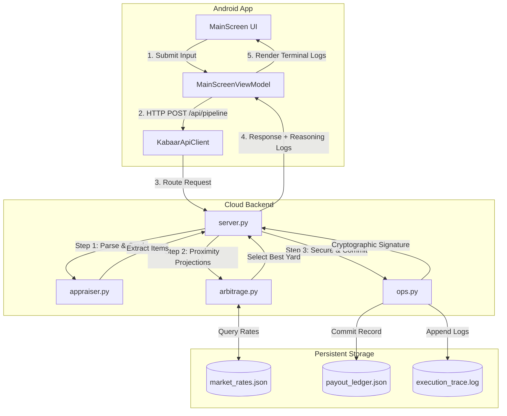

# KabaarAgent 🤖♻️

**KabaarAgent** is a production-ready, agentic full-stack mobile application built for informal scrap collectors and recycling traders. It automates visual/textual appraisal, matches transactions against real-time commodity indices, signs trades cryptographically, and records them in a secure local ledger—displaying the internal agent reasoning live.

Developed using **Google Antigravity 2.0 SDK** and powered by **Gemini 3.5 Flash**.

---

## 📖 Table of Contents
1. [System Architecture](#-system-architecture)
2. [Agentic Engine Components](#-agentic-engine-components)
3. [APIs and Fallback Mechanisms](#-apis-and-fallback-mechanisms)
4. [Integration Specifications](#-integration-specifications)
5. [Getting Started](#-getting-started)
    - [Running the Cloud Backend](#running-the-cloud-backend)
    - [Running the Android Client](#running-the-android-client)
    - [Running Tests](#running-tests)
6. [Cloud Deployment](#-cloud-deployment)

---

## 🏗️ System Architecture

The project segregates a Python FastAPI microservice pipeline (backend) and a Kotlin Jetpack Compose Android client (frontend) communicating over standard REST protocols.



---

## 🤖 Agentic Engine Components

The solution is divided into three distinct agents orchestrated concurrently:

### 1. The Appraiser Agent (`backend/appraiser/`)
*   **Role**: Visual and textual material classification, weight translation, and quality grading.
*   **Capabilities**: Processes multilingual descriptions (transliterated Urdu/English, e.g., *"5kg copper wires aur purani copper tonti, baqi loha hai"*) or base64 images.
*   **Outputs**: List of itemized materials matching strict types (`Copper`, `Iron`, `Aluminum`, `Cardboard`), weights (in kg), and purity grades (`High`, `Medium`, `Low`).

### 2. The Arbitrage Matcher Agent (`backend/arbitrage/`)
*   **Role**: Smart logistics routing and payout optimization.
*   **Capabilities**: Reads a localized database of recycling yards (`market_rates.json`), calculates physical proximity using the Haversine formula, verifies yard compatibility/minimum batch thresholds, and picks the highest-paying buyer.
*   **Outputs**: Recommended yard details, payout summary, and negotiation logs.

### 3. The Operations Ledger Agent (`backend/ops/`)
*   **Role**: Integrity assurance, receipt issuance, and auditable logging.
*   **Capabilities**: Computes an HMAC-SHA256 signature over the transaction details, appends records to `payout_ledger.json`, schedules dispatch times, and compiles logs.
*   **Outputs**: Security signatures, pickup receipts, and execution traces.

---

## 🔌 APIs and Fallback Mechanisms

To ensure high availability in remote areas with unstable network connectivity, the system is designed with advanced fallback logic:

*   **Real APIs (Gemini 3.5 Flash)**:
    *   Integrates both the modern `google-genai` and legacy `google-generativeai` Python SDKs.
    *   Uses structural JSON schema prompts to classify items and grade purity from text/images.
*   **Mock / Offline Fallback Engine**:
    *   If the `GEMINI_API_KEY` is absent or network requests fail, the appraiser gracefully routes the payload to a local regex parser.
    *   Translates Urdu terms (e.g. `loha` $\rightarrow$ Iron, `tamba` $\rightarrow$ Copper, `gatta` $\rightarrow$ Cardboard) and normalizes local units (e.g., Maund/Mann $\rightarrow$ 40kg) automatically.

---

## ⚙️ Integration Specifications

The coordination between components is defined in [antigravity.json](file:///c:/Projects/kabaarAgent/antigravity.json), representing the pipeline layout:

```json
{
  "pipeline_name": "KabaarAgent Pipeline",
  "version": "2.0",
  "engine": "gemini-3.5-flash",
  "components": [
    {
      "name": "Appraiser",
      "path": "backend/appraiser/appraiser.py",
      "inputs": ["description", "image_base64"]
    },
    {
      "name": "ArbitrageMatcher",
      "path": "backend/arbitrage/arbitrage.py",
      "inputs": ["items", "latitude", "longitude"]
    },
    {
      "name": "OperationsLedger",
      "path": "backend/ops/ops.py",
      "inputs": ["items", "valuation", "optimal_yard"]
    }
  ]
}
```

---

## 🚀 Getting Started

### Prerequisites
*   Python 3.10+
*   Android SDK / Android Studio (with Java 17)

### Running the Cloud Backend
1. Install Python dependencies:
   ```bash
   pip install -r requirements.txt
   ```
2. Set your API Key (Optional):
   ```bash
   set GEMINI_API_KEY="your-api-key"
   ```
3. Run the FastAPI development server:
   ```bash
   python backend/server.py
   ```
   The backend will be available at `http://localhost:8000`.

### Running the Android Client
1. Open the `/android` directory in Android Studio.
2. Ensure the JDK is set to **Java 17**.
3. Build the application and run it on an Android Emulator.
4. Use **"Camera Mock"** or **"Voice Mock"** to load inputs and click **"RUN PIPELINE APPRAISAL"** to view live reasoning.

### Running Tests
To run the automated end-to-end integration test suite locally:
```bash
python backend/appraiser/appraiser.py "5kg copper wires aur purani copper tonti, baqi loha hai"
```

---

## ☁️ Cloud Deployment

The backend is fully deployed to **Railway Cloud** and containerized using Docker:

*   **Production API URL**: [https://kabaar-agent-production.up.railway.app/](https://kabaar-agent-production.up.railway.app/)
*   **Docker Container**: [Dockerfile](file:///c:/Projects/kabaarAgent/Dockerfile) binds to the dynamic host port (`$PORT`) to support cloud load balancers.
*   **Android App Integration**: The production Android app is compiled to point directly to the live Railway production endpoint out-of-the-box.
